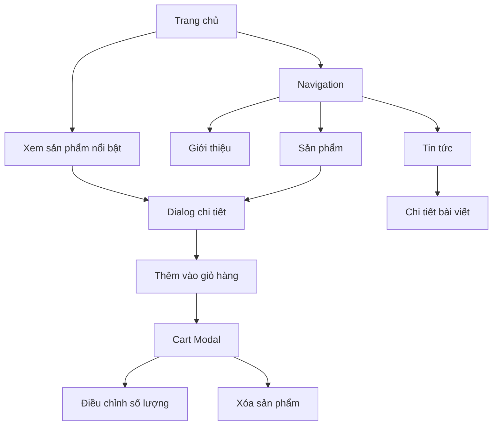

## 1. Tổng quan sản phẩm

Tiệm Ngọc Nhỏ là website trưng bày và bán trang sức ngọc cao cấp với thiết kế tối giản, mang đậm phong cách Á Đông. Website cung cấp trải nghiệm mua sắm trực tuyến tinh tế với các hiệu ứng chuyển động mượt mà.

- Giải quyết nhu cầu: Mua sắm trang sức ngọc chất lượng online
- Đối tượng: Khách hàng yêu thích trang sức truyền thống và hiện đại
- Giá trị: Kết nối thương hiệu Việt với người yêu ngọc thật

## 2. Tính năng cốt lõi

### 2.1 Vai trò người dùng
| Vai trò | Phương thức đăng ký | Quyền hạn cốt lõi |
|---------|-------------------|------------------|
| Khách mua hàng | Không cần đăng ký | Xem sản phẩm, thêm vào giỏ hàng, đặt hàng |
| Khách hàng đăng ký | Email/SĐT | Lưu giỏ hàng, theo dõi đơn hàng, nhận ưu đãi |

### 2.2 Mô-đun chức năng
Website Tiệm Ngọc Nhỏ bao gồm các trang chính:
1. **Trang chủ**: Banner sản phẩm nổi bật, giới thiệu tổng quan, navigation
2. **Giới thiệu**: Thông tin thương hiệu, giá trị cốt lõi, câu chuyện thương hiệu
3. **Tin tức**: Danh sách bài viết, chi tiết bài viết, bài viết liên quan
4. **Sản phẩm**: Danh mục sản phẩm, bộ lọc, chi tiết sản phẩm, giỏ hàng

### 2.3 Chi tiết trang
| Tên trang | Mô-đun | Mô tả tính năng |
|-----------|---------|-----------------|
| Trang chủ | Hero Banner | Hiển thị hình ảnh nổi bật với hiệu ứng fade-in, chuyển động nhẹ nhàng |
| Trang chủ | Sản phẩm nổi bật | Hiển thị 6-8 sản phẩm nổi bật với hover animation |
| Trang chủ | Navigation | Menu cố định, smooth scroll, responsive |
| Giới thiệu | Hero Section | Hình ảnh thương hiệu với slogan "Small Gem, True Beauty" |
| Giới thiệu | Nội dung thương hiệu | Giới thiệu câu chuyện, giá trị cốt lõi, cam kết chất lượng |
| Tin tức | Danh sách bài viết | Grid layout với hình ảnh thumbnail, tiêu đề, mô tả ngắn |
| Tin tức | Phân trang | Load more hoặc phân trang số |
| Sản phẩm | Danh mục sản phẩm | Grid responsive, filter theo loại ngọc, giá, màu sắc |
| Sản phẩm | Card sản phẩm | Hình ảnh, tên, giá, nút "Thêm vào giỏ", hover effect |
| Sản phẩm | Dialog chi tiết | Modal hiển thị thông tin chi tiết, hình ảnh phóng to, mô tả |
| Giỏ hàng | Cart icon | Hiển thị số lượng sản phẩm trong giỏ |
| Giỏ hàng | Cart modal | Danh sách sản phẩm, thay đổi số lượng, xóa sản phẩm, tổng tiền |

## 3. Luồng hoạt động chính

### Luồng khách hàng
1. Truy cập trang chủ → Xem sản phẩm nổi bật
2. Click sản phẩm → Xem chi tiết trong dialog
3. Thêm vào giỏ hàng → Cart icon cập nhật số lượng
4. Click cart icon → Mở modal giỏ hàng
5. Điều chỉnh số lượng/xóa sản phẩm → Tổng tiền tự động cập nhật
6. Tiếp tục mua sắm hoặc thanh toán

### Luồng khám phá nội dung
1. Trang chủ → Navigation → Chọn trang Giới thiệu/Tin tức/Sản phẩm
2. Tìm kiếm và lọc sản phẩm theo nhu cầu
3. Đọc bài viết tin tức liên quan

## 4. Thiết kế giao diện

### 4.1 Phong cách thiết kế
- **Màu chủ đạo**: Nâu ấm (#6B5142) - từ logo thương hiệu
- **Màu phụ**: Beige (#E9C9A5) - từ logo thương hiệu
- **Màu accent**: Trắng (#FFFFFF) cho viền ngọc trong logo
- **Button style**: Rounded nhẹ, không shadow, border mỏng 1px
- **Typography**: Font chữ serif trang trọng cho tiêu đề, sans-serif cho nội dung
- **Layout**: Card-based với khoảng cách rộng, minimalism
- **Icon style**: Line icon mỏng, màu đơn sắc

### 4.2 Tổng quan thiết kế trang
| Tên trang | Mô-đun | Chi tiết UI |
|-----------|---------|-------------|
| Trang chủ | Hero Banner | Full-width, height 60vh, background gradient từ nâu sang beige, text trắng căn giữa |
| Trang chủ | Product Grid | 3 cột desktop, 2 cột tablet, 1 cột mobile, gap 24px, card có border-radius 8px |
| Giới thiệu | Content Section | Max-width 800px căn giữa, line-height 1.8, font-size 16px, margin-bottom 32px |
| Tin tức | Article Grid | 2 cột desktop, 1 cột mobile, card có shadow nhẹ, hover scale 1.02 |
| Sản phẩm | Filter Bar | Horizontal scroll mobile, dropdown desktop, background beige nhạt |
| Dialog | Product Detail | Max-width 800px, hình ảnh bên trái (50%), thông tin bên phải (50%), close button top-right |
| Cart Modal | Right sidebar | Width 400px desktop, full-width mobile, overlay nền mờ, slide-in animation |

### 4.3 Responsive Design
- **Desktop-first**: Thiết kế ưu tiên desktop (1440px), sau đó adaptive xuống
- **Breakpoints**: 1440px, 1024px, 768px, 480px
- **Touch optimization**: Button tối thiểu 44x44px, khoảng cách tap 8px
- **Performance**: Image lazy loading, font preload, minimal DOM elements