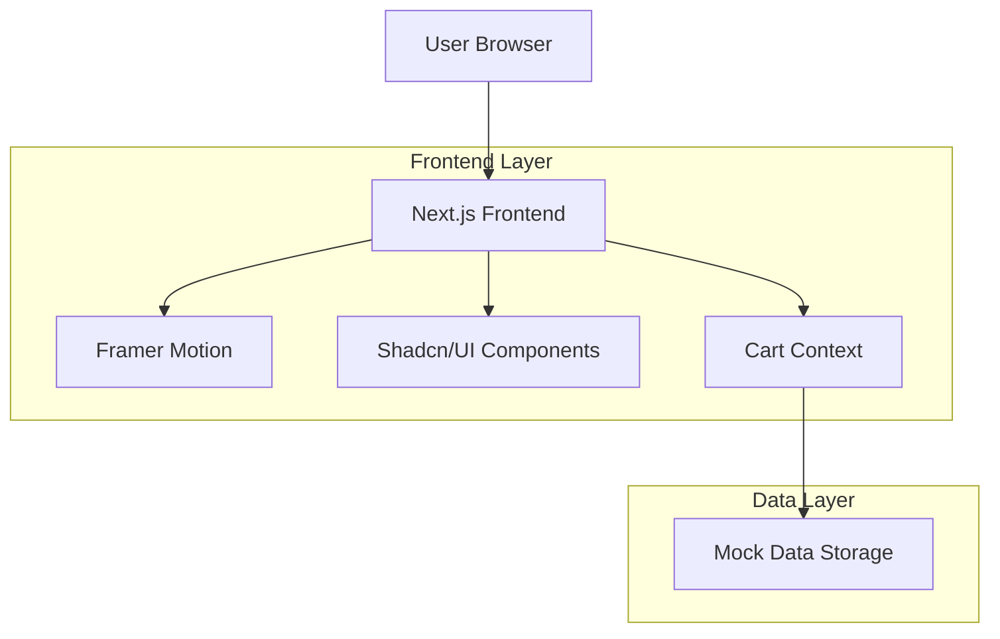

## 1. Thiết kế kiến trúc



## 2. Mô tả công nghệ

- **Frontend**: Next.js 14 + TypeScript + React 18
- **Styling**: Tailwind CSS 3.4
- **UI Components**: Shadcn/UI (latest)
- **Animation**: Framer Motion 11
- **Package Manager**: Bun (latest)
- **Runtime**: Bun runtime
- **Data Storage**: Mock data file (JSON)
- **Build Tool**: Next.js built-in (Turbopack)

## 3. Định nghĩa route

| Route | Mục đích |
|-------|----------|
| `/` | Trang chủ, hiển thị banner và sản phẩm nổi bật |
| `/about` | Trang giới thiệu thương hiệu và câu chuyện |
| `/news` | Trang tin tức với danh sách bài viết |
| `/news/[slug]` | Chi tiết bài viết tin tức |
| `/products` | Trang sản phẩm với danh mục và bộ lọc |
| `/products/[category]` | Sản phẩm theo danh mục |

## 4. Cấu trúc dự án

```
src/
├── app/
│   ├── layout.tsx          # Root layout với providers
│   ├── page.tsx            # Trang chủ
│   ├── about/page.tsx      # Trang giới thiệu
│   ├── news/page.tsx       # Trang tin tức
│   ├── news/[slug]/page.tsx # Chi tiết tin tức
│   ├── products/page.tsx   # Trang sản phẩm
│   └── globals.css         # Global styles
├── components/
│   ├── ui/                 # Shadcn/UI components
│   ├── layout/            # Layout components (Header, Footer, Navigation)
│   ├── home/              # Home page components (Hero, FeaturedProducts)
│   ├── products/          # Product components (ProductCard, ProductGrid, ProductDialog)
│   ├── cart/              # Cart components (CartIcon, CartModal, CartItem)
│   └── common/            # Shared components (Loading, Error)
├── contexts/
│   └── CartContext.tsx    # Cart state management
├── data/
│   └── mockData.ts        # Mock data cho products, news, about
├── types/
│   └── index.ts           # TypeScript type definitions
├── lib/
│   └── utils.ts           # Utility functions
└── config/
    └── site.ts            # Site configuration
```

## 5. Định nghĩa kiểu dữ liệu

```typescript
// Product types
export interface Product {
  id: string;
  name: string;
  name_vi: string;
  description: string;
  description_vi: string;
  price: number;
  originalPrice?: number;
  images: string[];
  category: string;
  material: string;
  color: string;
  size: string;
  inStock: boolean;
  featured: boolean;
  createdAt: string;
}

export interface CartItem {
  product: Product;
  quantity: number;
}

// News types
export interface NewsArticle {
  id: string;
  title: string;
  title_vi: string;
  excerpt: string;
  excerpt_vi: string;
  content: string;
  content_vi: string;
  image: string;
  author: string;
  publishedAt: string;
  slug: string;
}

// Cart context types
export interface CartContextType {
  items: CartItem[];
  addItem: (product: Product, quantity?: number) => void;
  removeItem: (productId: string) => void;
  updateQuantity: (productId: string, quantity: number) => void;
  clearCart: () => void;
  totalItems: number;
  totalPrice: number;
}
```

## 6. Mock Data Structure

```typescript
// data/mockData.ts
export const mockProducts: Product[] = [
  {
    id: "1",
    name: "Jade Bangle - Classic Green",
    name_vi: "Vòng Ngọc Lục Bảo Cổ Điển",
    description: "Premium quality natural jade bangle with deep green color",
    description_vi: "Vòng ngọc lục bảo chất lượng cao, màu xanh đậm tự nhiên",
    price: 2500000,
    originalPrice: 3000000,
    images: ["/images/products/jade-bangle-1.jpg"],
    category: "jade",
    material: "Natural Jade",
    color: "Green",
    size: "58mm",
    inStock: true,
    featured: true,
    createdAt: "2024-01-01"
  },
  // ... more products
];

export const mockNews: NewsArticle[] = [
  {
    id: "1",
    title: "The Art of Jade Selection",
    title_vi: "Nghệ Thuật Chọn Ngọc",
    excerpt: "Learn how to identify quality jade and its characteristics",
    excerpt_vi: "Học cách nhận biết ngọc chất lượng và đặc điểm của nó",
    content: "Full article content...",
    content_vi: "Nội dung bài viết đầy đủ...",
    image: "/images/news/jade-selection.jpg",
    author: "Tiệm Ngọc Nhỏ",
    publishedAt: "2024-01-15",
    slug: "nghe-thuat-chon-ngoc"
  },
  // ... more articles
];

export const siteConfig = {
  name: "Tiệm Ngọc Nhỏ",
  tagline: "Small Gem, True Beauty",
  description: "Trang sức ngọc cao cấp với thiết kế tinh tế",
  colors: {
    primary: "#6B5142",
    secondary: "#E9C9A5",
    accent: "#FFFFFF",
    background: "#FAF8F5",
    text: "#2C1810"
  }
};
```

## 7. Component Architecture

### Layout Components
- **Header**: Fixed navigation với logo và cart icon
- **Navigation**: Smooth scroll, responsive menu
- **Footer**: Thông tin liên hệ, social links

### Animation Components
- **FadeInWrapper**: Framer Motion wrapper cho fade-in effects
- **HoverCard**: Hover animation cho product cards
- **SmoothTransition**: Page transition animations

### Cart Management
- **CartContext**: React Context cho cart state
- **LocalStorage**: Persist cart data trong browser
- **Real-time Updates**: Cart icon và modal tự động cập nhật

## 8. Performance Optimization

### Core Web Vitals Targets
- **LCP (Largest Contentful Paint)**: < 2.5s
- **FID (First Input Delay)**: < 100ms
- **CLS (Cumulative Layout Shift)**: < 0.1
- **Lighthouse Score**: > 90

### Optimization Strategies
1. **Image Optimization**: Next.js Image component với lazy loading
2. **Font Optimization**: Preload critical fonts, sử dụng system fonts
3. **Code Splitting**: Dynamic imports cho heavy components
4. **Bundle Size**: Tree shaking, minimal dependencies
5. **CSS**: Tailwind JIT mode, purge unused styles
6. **Caching**: Static generation cho pages, client-side caching

### Development Commands
```bash
# Install dependencies
bun install

# Development server
bun dev

# Build for production
bun build

# Start production server
bun start

# Type checking
bun tsc --noEmit

# Linting
bun lint
```

## 9. Testing Strategy

### Manual Testing Checklist
- [ ] Responsive design trên các breakpoints
- [ ] Cart functionality (add/remove/update)
- [ ] Product dialog interactions
- [ ] Page navigation và transitions
- [ ] Performance trên mobile network
- [ ] Accessibility (keyboard navigation, screen readers)

### Performance Testing
- Lighthouse CI cho mỗi pull request
- Bundle size monitoring
- Runtime performance profiling